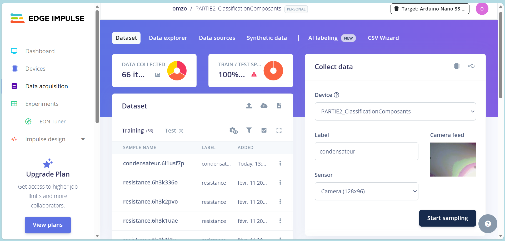
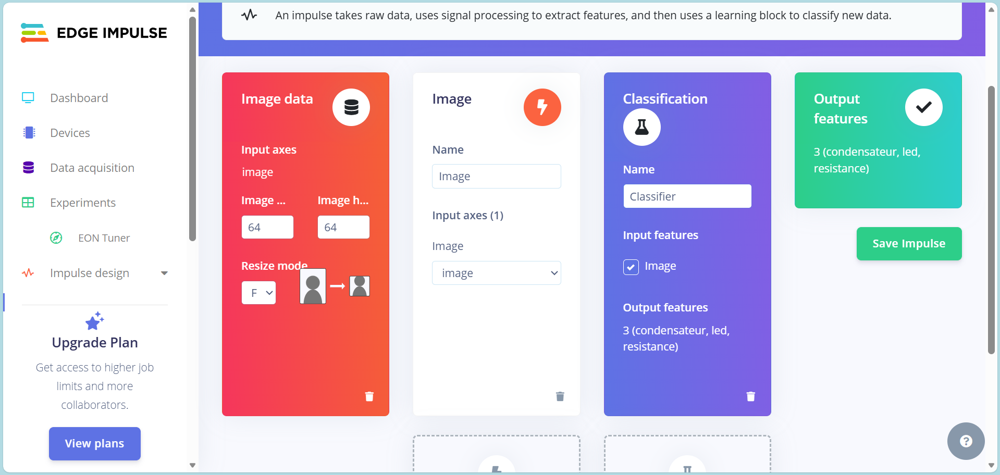
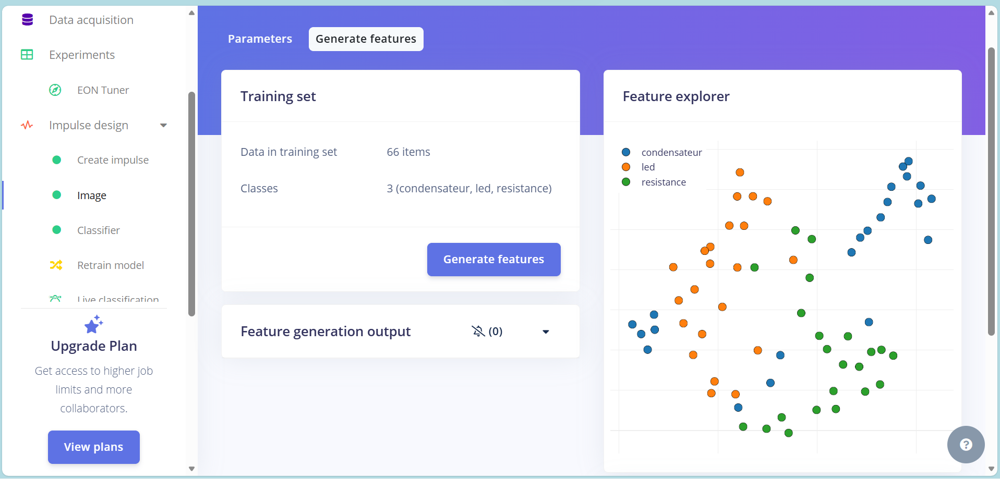
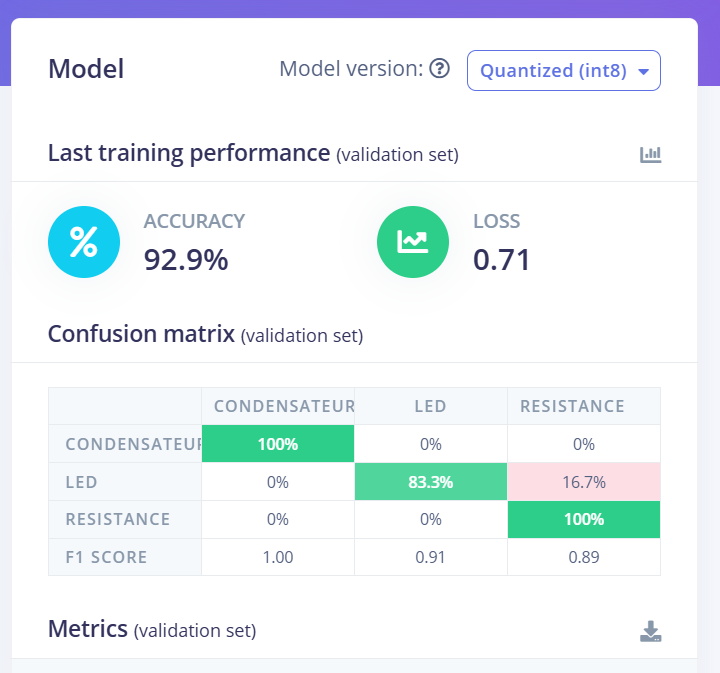

## Entraînement d’un modèle CNN dans Edge Impulse
Ce fichier décrit l’ensemble des étapes suivies pour entraîner un modèle de classification d’images dans Edge Impulse, conformément aux consignes du projet.

## 1. Introduction

Dans cette partie du projet, un modèle de classification d’images est entraîné à l’aide de la plateforme Edge Impulse afin de reconnaître différents composants électroniques (résistances, LED, condensateurs).

Contrairement à une importation manuelle d’images, les données ont été collectées directement via Edge Impulse en utilisant la caméra OV7675 connectée à une carte Arduino Nano 33 BLE Sense.

L’objectif est d’obtenir un modèle compatible avec les microcontrôleurs, capable d’être déployé et exécuté directement sur une carte Arduino Nano 33 BLE dans un contexte TinyML.
---

## 2. Acquisition des données (Data Acquisition)
### 2.1 Configuration matérielle

- Carte : Arduino Nano 33 BLE Sense
- Caméra : OV7675
- Connexion : USB vers PC
- Plateforme : Edge Impulse (via WebUSB)

La carte est connectée directement à Edge Impulse via le navigateur, permettant la capture d’images en temps réel.

### 2.2 Collecte des images

Les données ont été collectées dans l’onglet Data acquisition de Edge Impulse. 

Procédure suivie :

- Connexion de la carte Arduino au projet Edge Impulse.
- Accès à la section Data Acquisition.
- Capture d’images en temps réel depuis la caméra.
- Attribution d’un label à chaque capture :
    resistor
    led
    capacitor

Répétition de la capture sous différents angles et positions afin d’améliorer la robustesse du modèle.

Les images sont automatiquement enregistrées dans le dataset du projet.

### 2.3 Constitution du dataset

Le dataset a été construit progressivement en capturant plusieurs images par classe (22 pour chacun).

Afin d’améliorer la qualité du modèle :

- Les composants ont été positionnés sous différents angles.
- Des variations légères d’éclairage ont été introduites.
---

## 3. Création de l’Impulse

L’Impulse correspond à la chaîne complète de traitement des données dans Edge Impulse.

Dans l’onglet Impulse Design, les blocs suivants ont été configurés : 

### 3.1 Paramètres Image

- Taille des images : 64 × 64 pixels
- Mode de redimensionnement automatique
- Color depth : Grayscale

Ce choix permet de réduire la complexité du modèle tout en conservant l’information essentielle.

### 3.2 Architecture de l’Impulse

L’Impulse est composé de :
- Bloc Image (prétraitement)
- Bloc Classification (Keras / CNN)

Après configuration, l’Impulse est sauvegardé.
---

## 4. Extraction des caractéristiques

Dans l’onglet Image :

- Conversion automatique des images en niveaux de gris.
- Redimensionnement en 64 × 64 pixels.
- Génération des features via Generate Features.

À cette étape, Edge Impulse transforme les images brutes en données exploitables par le réseau de neurones.

Capture si contre: 
---

## 5. Entraînement du réseau de neurones (CNN)

Dans l’onglet NN Classifier, les paramètres suivants ont été configurés :

- Nombre d’epochs : entre 100 et 200
- Architecture CNN légère adaptée à l’embarqué
- Optimisation pour microcontrôleur

L’entraînement est lancé via Start Training. 

### 5.1 Analyse des performances

Les performances sont évaluées à l’aide :
- Accuracy
- Loss
- Matrice de confusion
- Feature Explorer

Ces indicateurs permettent d’identifier les classes bien reconnues et celles nécessitant plus de données.

Résultats de notre entrainement de model: 
---

## 6. Ajustement des hyperparamètres

Pour optimiser le modèle, plusieurs ajustements peuvent être testés :
- Modification du nombre de couches convolutionnelles
- Ajustement du nombre de filtres
- Modification de la taille des noyaux (kernel size)
- Ajout de Dropout pour limiter le surapprentissage

L’objectif est d’obtenir un bon compromis entre :
- Précision
- Taille mémoire
- Temps d’inférence embarqué
---

## 7. Remarques sur les performances

La qualité du modèle dépend fortement de :
- La diversité des images capturées
- Le nombre d’exemples par classe
- La qualité de l’étiquetage

Une augmentation du nombre d’images par classe améliore :
- La robustesse du modèle
- La généralisation
- La stabilité des prédictions
---

## 8. Déploiement

Une fois le modèle validé :
- Accès à l’onglet Deployment
- Sélection de la cible : Arduino Library
- Génération de la bibliothèque compatible Arduino

Edge Impulse génère :
- Le modèle TensorFlow Lite Micro
- Le code C++ embarqué
- Les fichiers nécessaires à l’inférence temps réel

Ce code est ensuite utilisé dans la partie 2-ArduinoCamera du projet pour effectuer l’inférence embarquée.
