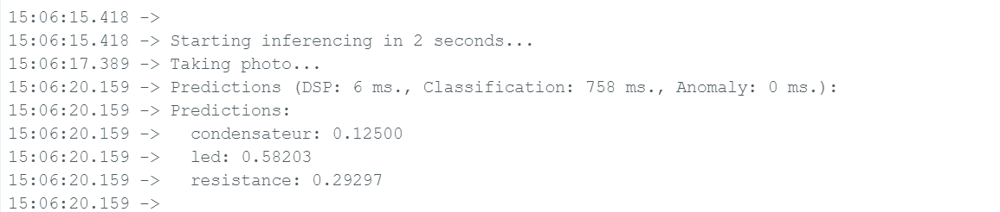
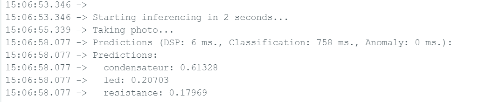
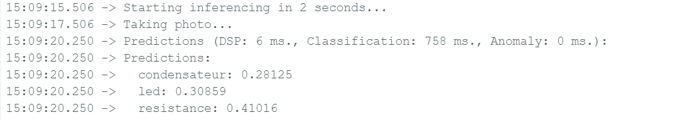
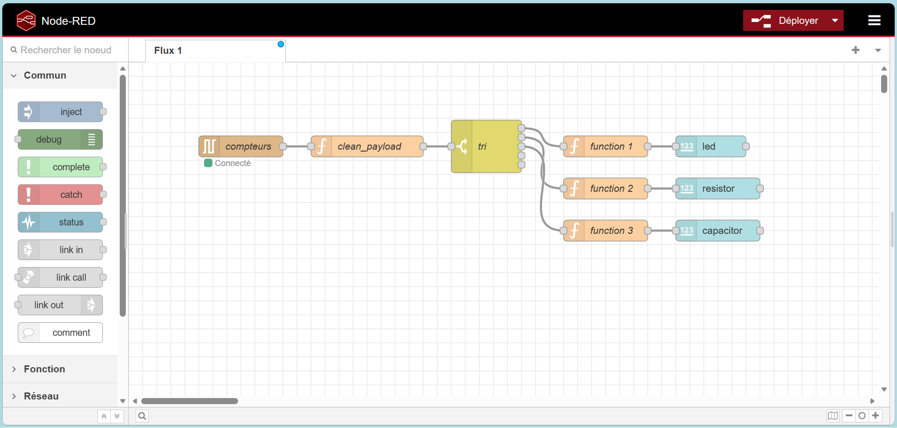
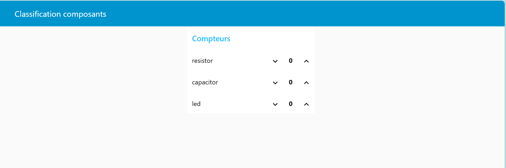
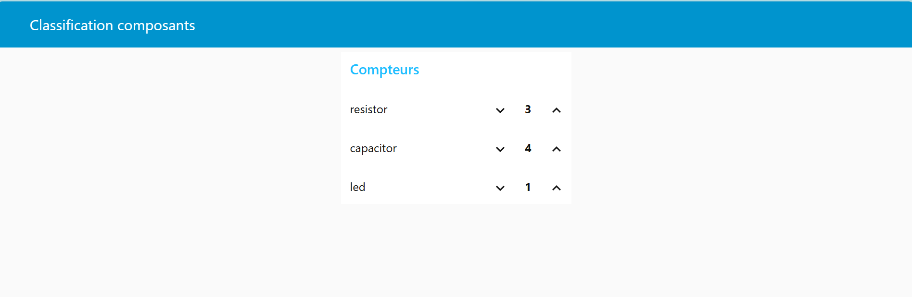

# Résultats expérimentaux – Classification embarquée

## 1. Objectif des tests

Après le déploiement du modèle entraîné dans Edge Impulse sur l’Arduino Nano 33 BLE Sense, plusieurs tests expérimentaux ont été réalisés afin d’évaluer :

- La précision réelle du modèle
- La stabilité des prédictions
- La robustesse face aux variations d’angle et d’éclairage
- Le comportement en conditions réelles

Les tests ont été effectués via le Serial Monitor (115200 bauds).

## 2. Temps d’inférence

Exemple extrait du Serial Monitor :

Predictions (DSP: 6 ms., Classification: 758 ms., Anomaly: 0 ms.)

Analyse :

    DSP : ~6 ms
    Classification : ~758 ms
    Temps total ≈ 764 ms

Le modèle est relativement lent (≈ 1 image par seconde), ce qui est cohérent avec :

    Un microcontrôleur limité en ressources
    Un modèle CNN embarqué
---

## 3. Tests par classe
### 3.1 Exemple 1 – LED

Capture série :
- led: 0.58203
- condensateur: 0.12500
- resistance: 0.29297

Observation : 
    La LED est correctement identifiée
    La confiance reste modérée (~0.58)
    Présence de confusion avec la résistance

### 3.2 Exemple 2 – Condensateur
Capture série :
- condensateur: 0.61328
- led: 0.20703
- resistance: 0.17969

Observation : 
    Classe correcte prédite
    Confiance maximale ≈ 0.61
    Stabilité moyenne

### 3.3 Exemple 3 – Résistance
Capture série :
- condensateur: 0.28125
- led: 0.30859
- resistance: 0.41016

Observation : 
    Résistance détectée
    Confiance faible (~0.41)
    Forte ambiguïté entre classes
---

## Visualisation temps réel avec Node-RED

### 4.1 Architecture de traitement

Après l’inférence embarquée (Arduino + modèle Edge Impulse), les résultats de classification sont transmis via liaison série vers Node-RED.

Le flux Node-RED est structuré comme suit :

compteurs → clean_payload → tri → fonctions spécifiques → dashboard

Aperçu: 

compteurs : récupération des données brutes envoyées par l’Arduino
clean_payload : nettoyage et formatage du message
tri : séparation des classes détectées
function 1/2/3 : extraction des compteurs pour chaque composant
Dashboard : affichage des résultats en temps réel

### 4.2 Dashboard de classification

Le tableau de bord affiche en temps réel :

- Nombre de résistances détectées
- Nombre de condensateurs détectés
- Nombre de LEDs détectées

🔹 État initial

Tous les compteurs sont initialisés à 0.
Aperçu: 

🔹 Après détection

Exemple de résultat :

Classe	Nombre détecté :
    Resistor	3
    Capacitor	4
    LED	1

Aperçu: 

Le dashboard se met à jour dynamiquement à chaque nouvelle classification.

### 4.3 Validation fonctionnelle

Les tests réalisés montrent :

- Mise à jour correcte des compteurs
- Aucun décalage temporel visible
- Traitement stable des messages série
- Séparation correcte des classes

L’intégration Node-RED valide donc :

✔ La cohérence du pipeline TinyML
✔ La transmission fiable des résultats
✔ L’exploitation temps réel des données
---

## 5. Analyse de robustesse

Les résultats montrent :

1. Les prédictions restent majoritairement correctes
2. Les scores de confiance sont faibles (0.4 – 0.7)
3. Le modèle présente une instabilité selon :
    L’angle du composant
    La distance caméra-objet
    L’éclairage
---

## 6. Causes possibles des performances limitées

Plusieurs facteurs expliquent ces résultats :

1. Dataset de taille limitée
2. Variabilité insuffisante des angles
3. Similarité visuelle entre certains composants
4. Résolution réduite (64 × 64)
---

## 7. Pistes d’amélioration

Pour améliorer la robustesse :

- Augmenter le nombre d’images par classe

- Introduire davantage de variations d’angle

- Varier les conditions d’éclairage

- Ajouter data augmentation

- Augmenter légèrement la résolution (en fonction d'une mémoire suffisante)

- Ajuster l’architecture CNN

## 8. Conclusion des tests

Le système fonctionne correctement et réalise une classification embarquée temps réel.

Cependant :

La confiance moyenne reste modérée

Le modèle nécessite un enrichissement du dataset pour améliorer sa robustesse

## Ces résultats démontrent la faisabilité du TinyML embarqué, tout en mettant en évidence les limites liées aux contraintes matérielles et à la taille du dataset.